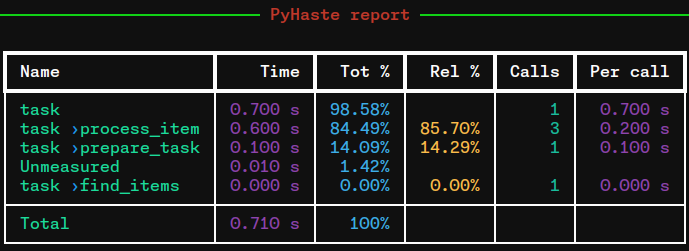

# PyHaste

[](https://github.com/cocreators-ee/pyhaste/actions/workflows/publish.yaml)
[](https://github.com/astral-sh/ruff)
[](https://github.com/cocreators-ee/pyhaste/blob/master/.pre-commit-config.yaml)
[](https://pypi.org/project/pyhaste/)
[](https://pypi.org/project/pyhaste/)
[](https://opensource.org/licenses/BSD-3-Clause)

Python code speed analyzer.



Monitor the performance of your scripts etc. tools and understand where time is spent.


## Installation

It's a Python library, what do you expect?

```bash
pip install pyhaste
# OR
poetry add pyhaste
```

## Usage

To measure your code, `pyhaste` exports a `measure` context manager, give it a name as an argument. Once you want a report call `report` from `pyhaste`.

```python
import time

from pyhaste import measure, report


def prepare_task():
  time.sleep(0.1)


def find_items():
  with measure("find_items"):
    return [1, 2, 3]


def process_item(item):
  with measure("process_item"):
    time.sleep(item * 0.1)


with measure("task"):
  with measure("prepare"):
    prepare_task()

  for item in find_items():
    process_item(item)

time.sleep(0.01)
report()
```

```
───────────────── PyHaste report ─────────────────

┏━━━━━━━━━━━━━━━━━━━━━━┳━━━━━━━━━┳━━━━━━━━┓
┃ Name                 ┃    Time ┃      % ┃
┡━━━━━━━━━━━━━━━━━━━━━━╇━━━━━━━━━╇━━━━━━━━┩
│ task                 │ 0.700 s │ 98.58% │
│ task -> process_item │ 0.600 s │ 84.49% │
│ task -> prepare      │ 0.100 s │ 14.09% │
│ Unmeasured           │ 0.010 s │  1.42% │
│ task -> find_items   │ 0.000 s │  0.00% │
├──────────────────────┼─────────┼────────┤
│ Total                │ 0.710 s │   100% │
└──────────────────────┴─────────┴────────┘
```

In case you need more complex analysis, you might benefit from `pyhaste.Analyzer` and creating your own instances, e.g. for measuring time spent on separate tasks in a longer running job:

```python
import time
from random import uniform
from pyhaste import Analyzer

for item in [1, 2, 3]:
    analyzer = Analyzer()
    with analyzer.measure("process_item"):
        with analyzer.measure("db.find"):
          time.sleep(uniform(0.04, 0.06) * item)
        with analyzer.measure("calculate"):
          time.sleep(uniform(0.1, 0.15) * item)
        with analyzer.measure("save"):
          time.sleep(uniform(0.05, 0.075) * item)
    time.sleep(uniform(0.01, 0.025) * item)
    analyzer.report()
```

```
─────────────────── PyHaste report ────────────────────

┏━━━━━━━━━━━━━━━━━━━━━━━━━━━━━━┳━━━━━━━━━┳━━━━━━━━┓
┃ Name                         ┃    Time ┃      % ┃
┡━━━━━━━━━━━━━━━━━━━━━━━━━━━━━━╇━━━━━━━━━╇━━━━━━━━┩
│ process_item(1)              │ 0.217 s │ 91.81% │
│ process_item(1) -> calculate │ 0.108 s │ 45.87% │
│ process_item(1) -> save      │ 0.054 s │ 22.97% │
│ process_item(1) -> db.find   │ 0.054 s │ 22.95% │
│ Unmeasured                   │ 0.019 s │  8.19% │
├──────────────────────────────┼─────────┼────────┤
│ Total                        │ 0.236 s │   100% │
└──────────────────────────────┴─────────┴────────┘

─────────────────── PyHaste report ────────────────────

┏━━━━━━━━━━━━━━━━━━━━━━━━━━━━━━┳━━━━━━━━━┳━━━━━━━━┓
┃ Name                         ┃    Time ┃      % ┃
┡━━━━━━━━━━━━━━━━━━━━━━━━━━━━━━╇━━━━━━━━━╇━━━━━━━━┩
│ process_item(2)              │ 0.465 s │ 92.61% │
│ process_item(2) -> calculate │ 0.214 s │ 42.68% │
│ process_item(2) -> save      │ 0.139 s │ 27.77% │
│ process_item(2) -> db.find   │ 0.111 s │ 22.15% │
│ Unmeasured                   │ 0.037 s │  7.39% │
├──────────────────────────────┼─────────┼────────┤
│ Total                        │ 0.502 s │   100% │
└──────────────────────────────┴─────────┴────────┘

─────────────────── PyHaste report ────────────────────

┏━━━━━━━━━━━━━━━━━━━━━━━━━━━━━━┳━━━━━━━━━┳━━━━━━━━┓
┃ Name                         ┃    Time ┃      % ┃
┡━━━━━━━━━━━━━━━━━━━━━━━━━━━━━━╇━━━━━━━━━╇━━━━━━━━┩
│ process_item(3)              │ 0.759 s │ 93.85% │
│ process_item(3) -> calculate │ 0.424 s │ 52.34% │
│ process_item(3) -> save      │ 0.178 s │ 21.99% │
│ process_item(3) -> db.find   │ 0.158 s │ 19.51% │
│ Unmeasured                   │ 0.050 s │  6.15% │
├──────────────────────────────┼─────────┼────────┤
│ Total                        │ 0.809 s │   100% │
└──────────────────────────────┴─────────┴────────┘
```

## Development

Issues and PRs are welcome!

Please open an issue first to discuss the idea before sending a PR so that you know if it would be wanted or needs
re-thinking or if you should just make a fork for yourself.

For local development, make sure you install [pre-commit](https://pre-commit.com/#install), then run:

```bash
pre-commit install
poetry install
poetry run ptw .
poetry run python example.py

cd fastapi_example
poetry run python example.py
```

## License

The code is released under the BSD 3-Clause license. Details in the [LICENSE.md](./LICENSE.md) file.

# Financial support

This project has been made possible thanks to [Cocreators](https://cocreators.ee) and [Lietu](https://lietu.net). You
can help us continue our open source work by supporting us
on [Buy me a coffee](https://www.buymeacoffee.com/cocreators).

[](https://www.buymeacoffee.com/cocreators)
